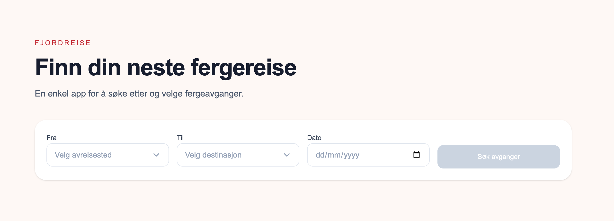

# Fjordreise

Fjordreise is a small booking app for searching and selecting ferry departures.

The app focuses on a clear and predictable flow:

> search → view results → select departure → see summary.

---

## Live Demo

(No login required)

https://fjordreise.vercel.app/

---

## Preview



---

## Getting Started

Run the development server:

```bash
npm run dev
# or
yarn dev
# or
pnpm dev
# or
bun dev
```

Open [http://localhost:3000](http://localhost:3000) with your browser to see the result.

---

## What the app does

- Search for ferry departures by route and date
- View available departures with time, duration, and price
- Select a departure
- View a summary of the selected trip

---

## Tech Stack

- Next.js (App Router)
- React
- TypeScript
- Tailwind CSS

---

## Technical Choices

- Uses static mock data served through a Next.js API route
- No database or external services
- State is handled locally in components

The implementation is intentionally simple, focusing on user flow and UI rather than infrastructure.

---

## What I focused on

- Clear and predictable user flow
- Readable and maintainable component structure
- Consistent UI patterns (cards, buttons, layout)
- Avoiding unnecessary abstraction

---

## Edge Cases

- Prevent selecting the same origin and destination
- Show a clear empty state when no departures match
- Handle missing or invalid departureId in the summary page
- Allow the user to adjust search inputs and search again

---

## Trade-offs

- Static data instead of a real API
- Strict filtering (no fuzzy search or suggestions)
- No support for return trips or advanced booking logic

These choices keep the scope focused and the behavior predictable.

---

## What I would improve with more time

- Replace mock data with a real API
- Add dynamic availability and more routes
- Further improve accessibility (more complete keyboard navigation and expanded ARIA support)
- Add loading and transition states
- Expand route visualization beyond static images

---

## Challenges

- Balancing simplicity vs. abstraction
- Deciding what to extract vs. keep inline
- Keeping UI consistent without over-designing

---

## Notes

- Mock data is exposed via `/api/departures`
- Available dates in the dataset:
  - 15.04.2026
  - 16.04.2026

## Future improvements

I chose not to implement multilingual routing, even though ferry booking platforms are typically multilingual.

Since the brief did not require it, I prioritized completing the booking flow and keeping the solution focused and stable.

If I had more time, adding Norwegian and English support would be a natural next step.
